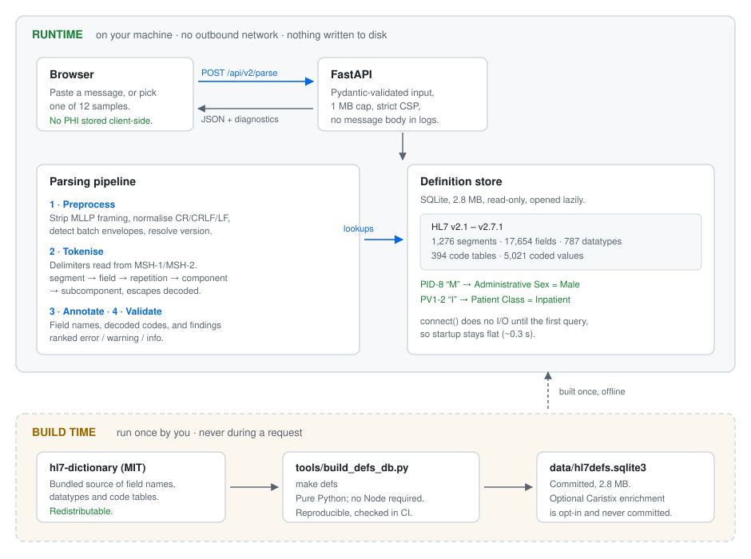
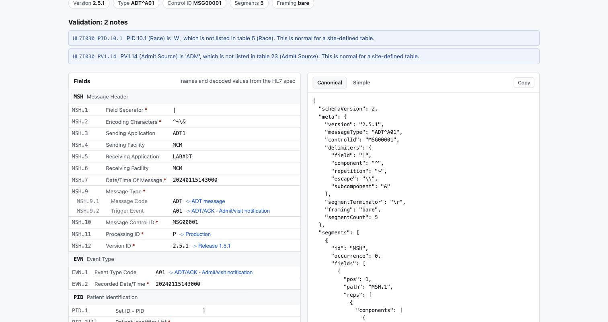
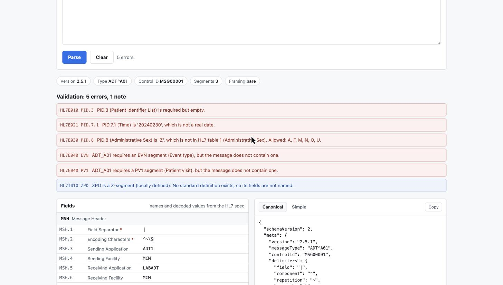

# HL7 to JSON

**A self-hosted HL7 v2 parser, field reference and validator.** Paste a message,
get structured JSON, named fields, decoded codes and a list of what is wrong
with it — without sending patient data to someone else's server.

Built for the people who work with HL7 v2 every day: **integration analysts**
debugging an interface, **developers** writing one, and **researchers** who need
to inspect clinical message data without a compliance conversation first.

---

## Why this exists

Most online HL7 tools ask you to paste a message into a website you do not
control. HL7 v2 messages routinely contain Protected Health Information, which
is exactly what your security team tells you not to do. So people either take
the risk, or fall back to counting pipe characters by hand.

This runs in your environment. Three properties make that claim real rather
than aspirational, and each is verifiable:

| Property | How to verify |
|---|---|
| No message content is stored or logged, server or client | Submit a message, then check Cache Storage, `localStorage` and the server log |
| No outbound network calls while handling a request | Run it with networking disabled — parsing and field lookups still work |
| No third-party assets | CSS and JS are same-origin; the CSP names no external host |

The definition data ships **inside** the repository, so the tool is fully
functional offline and in an air-gapped network.

---

## Architecture

The important line in this diagram is the one between **runtime** and **build
time**. Everything a request touches is local. The HL7 specification data is
compiled into a SQLite file once, offline, and only ever read from disk
afterwards.

<picture>
  <source media="(prefers-color-scheme: dark)" srcset="docs/architecture-dark.svg">
  
</picture>

### Why SQLite rather than JSON

The definition store holds 17,654 field definitions. Loading that as JSON would
mean parsing the whole file before answering a single question — hundreds of
milliseconds and ~100 MB of memory, paid on the first request.

`sqlite3.connect()` performs **no I/O until the first query**, and a point
lookup is a single B-tree seek against an OS-cached page. That is why 2.8 MB of
specification data can ship without startup cost, and `make bench-startup`
asserts nothing is loaded at import time so it stays that way.

---

## Quick start

```bash
git clone https://github.com/sudhi001/HL7_TO_JSON_WITH_FAST_API.git
cd HL7_TO_JSON_WITH_FAST_API
python -m venv .venv && source .venv/bin/activate
pip install -r requirements.txt
uvicorn main:app
```

Open <http://localhost:8000> and pick a sample from the dropdown — you do not
need to supply a message to try it.

**Requires Python 3.11+.** Tested on 3.11, 3.12 and 3.13 in CI, and 3.14
locally. No Node, no database server, no build step: the definition store is
committed.

For development with auto-reload, scope the watcher so it does not walk `.git/`
and your virtualenv:

```bash
uvicorn main:app --reload --reload-dir app --reload-dir templates
```

---

## For integration analysts



Paste a message and you get, for every segment and every HL7 version from 2.1
to 2.7.1:

- **Field names.** `PID.5.1` is *Family Name*, not a position you count to.
- **Decoded codes.** `PID-8: M` reads as **Male**; `PV1-2: I` as **Inpatient**;
  `MSH-9.2: A01` as **Admit/visit notification**. This is the lookup that
  otherwise means opening the specification in another tab.
- **Required-field markers**, datatype, length and repeatability on hover.
- **Repetitions kept apart.** `PID.3[1]` and `PID.3[2]` are shown as two
  identifiers — one a *Medical record number*, the other a *Social Security
  number* — not merged into one value.
- **Explicit nulls.** `|""|` (delete this value) is shown differently from `||`
  (no information supplied), because in an update message they are opposites.

Twelve sample messages ship with the tool — ADT, ORU, ORM, SIU, VXU, plus
deliberately awkward ones covering repetitions, escape sequences, custom
delimiters and Z-segments.

---

## For developers

### Output shapes

`canonical` is lossless and is the API contract. Segments are a list,
repetitions are a list, and every value carries its presence state:

```json
{
  "schemaVersion": 2,
  "meta": {
    "version": "2.5.1", "messageType": "ADT^A01", "controlId": "MSG00001",
    "delimiters": {"field": "|", "component": "^", "repetition": "~",
                   "escape": "\\", "subcomponent": "&"},
    "segmentTerminator": "\r", "framing": "bare", "segmentCount": 5
  },
  "segments": [
    {"id": "PID", "occurrence": 0, "fields": [
      {"pos": 3, "path": "PID.3", "reps": [
        {"components": [{"subs": [{"v": "MRN12345", "p": "present"}]}]},
        {"components": [{"subs": [{"v": "987654321", "p": "present"}]}]}
      ]}
    ]}
  ],
  "diagnostics": []
}
```

`simple` is a flatter projection for piping into `jq`. **Segments are always
arrays, even MSH** — the shape never depends on the data:

```json
{"PID": [{"3": ["MRN12345", "987654321"], "5": {"1": "SMITH", "2": "JOHN"}}]}
```

### API

| Method | Path | Purpose |
|---|---|---|
| `POST` | `/api/v2/parse` | Parse a message. `?shape=canonical\|simple`, `?annotate=true`, `?validate=true` |
| `POST` | `/api/v2/validate` | Findings only, with a `valid` flag and counts by severity |
| `GET` | `/api/v2/samples` | List bundled samples |
| `GET` | `/api/v2/samples/{id}` | One sample message |
| `GET` | `/api/v2/spec/versions` | HL7 versions in the store |
| `GET` | `/api/v2/spec/{version}/segments` | All segments for a version |
| `GET` | `/api/v2/spec/{version}/segments/{id}` | One segment and its fields |
| `GET` | `/api/v2/spec/{version}/tables/{id}` | A code table and its values |
| `GET` | `/api/v2/spec/{version}/datatypes/{id}` | A datatype and its components |
| `GET` | `/healthz` | Liveness |

Interactive documentation at `/docs`.

```bash
curl -X POST 'http://localhost:8000/api/v2/parse?annotate=true&validate=true' \
  -H 'Content-Type: application/json' \
  -d '{"message": "MSH|^~\\&|SEND|FAC|RECV|RFAC|20240101120000||ADT^A01|MSG1|P|2.5.1\rPID|1||MRN1||DOE^JOHN||19800101|M"}'
```

The specification endpoints work as a general HL7 reference, with no message
involved:

```bash
curl -s localhost:8000/api/v2/spec/2.5.1/tables/0001 | jq
curl -s localhost:8000/api/v2/spec/2.5.1/segments/PID | jq '.fields[7]'
```

### Deprecated endpoint

`POST /convert/hl7/json` still works and returns exactly what it always did —
**including its defects**, because that is the contract existing callers have.
It sends `Deprecation` and `Sunset` headers. It cannot represent a repeating
segment correctly by construction; migrate to `/api/v2/parse`.

---

## For researchers

- **Reproducible definition store.** `make defs` rebuilds
  `data/hl7defs.sqlite3` from a pinned upstream release, in pure Python. CI
  rebuilds it and fails if the result differs from what is committed, so the
  data behind any result is verifiable.
- **Stable, versioned output.** `schemaVersion` is in every response body, and
  the canonical shape is lossless — `serialize(parse(m)) == m` byte for byte,
  asserted across the corpus.
- **Every HL7 version 2.1 – 2.7.1** from one interface, so you can compare how
  a field is defined across versions.
- **No data egress**, which usually shortens the conversation with an IRB or
  privacy office considerably.
- **Deterministic and offline**, so a pipeline that uses it is repeatable.

The store is a plain SQLite file — query it directly if the API is not the
shape you want:

```sql
SELECT position, name, datatype, optionality
FROM segment_field WHERE version = '2.5.1' AND segment_id = 'PID';
```

---

## What it parses correctly

HL7 v2 is a deceptively awkward format. These are the cases that separate a
working parser from one that looks like it works:

| Case | Handled |
|---|---|
| `\r` segment terminator (the standard), plus `\r\n` and `\n` | Yes, with a diagnostic when it is not `\r` |
| Repeating segments — 30 `OBX` in a lab result | Yes, each kept with its occurrence |
| Delimiter precedence: field → **repetition** → component → subcomponent | Yes |
| Subcomponents (`&`) | Yes |
| Escape sequences `\F\ \S\ \T\ \R\ \E\ \Xdd\` and formatting commands | Yes |
| Encoding characters read from MSH-1/MSH-2, not assumed | Yes |
| MSH-1 and MSH-2 special cases | Yes — synthesised and stored verbatim |
| Empty `\|\|` vs explicit null `\|""\|` vs a literal space | Distinguished |
| MLLP framing, FHS/BHS batch envelopes | Stripped and detected |
| Z-segments | Kept, reported as informational |
| Non-HL7 input | Rejected with an explanation, not silently accepted |

The parser is verified against [hl7apy](https://github.com/crs4/hl7apy) as a
differential oracle, and round-trips every message in the corpus byte for byte.

---

## Validation



Severity means something specific:

| Severity | Meaning | Examples |
|---|---|---|
| `error` | Unambiguously wrong | Required field empty; `20240230` is not a real date; a non-repeating field repeats; a value outside a closed HL7 table; a segment the trigger event requires is missing |
| `warning` | Probably wrong, but real interfaces do it | Value longer than the specification allows; field beyond the segment definition; unknown segment |
| `info` | Worth knowing, not a defect | Z-segments; values outside a site-defined table; LF terminators |

Findings are ordered most-severe first, deduplicated, and collapsed after five
of the same kind — a 40-`OBX` result does not produce 40 identical lines. Each
one names the occurrence, so `OBX[3].11` tells you *which* OBX.

### Two checks deliberately left out

A validator that fires on valid messages trains people to ignore it, which is
worse than having none. So:

- **Unlisted values in user-defined tables are `info`, not `error`.** HL7 tables
  are either closed (an unlisted code really is wrong) or site-specific — Race,
  Religion and Marital Status are the usual examples, where local codes are
  legitimate. The bundled dataset does not record which kind a table is, so only
  a short list of tables known to be closed is enforced as an error.
- **Segment ordering and group cardinality are not checked.** Resolving nested
  optional groups is genuinely ambiguous, and a wrong answer is worse than no
  answer. Only segments a *required* group genuinely requires are reported.

---

## Security and compliance

Please read [SECURITY.md](SECURITY.md) before using this with real data.

Architecturally true of this application:

- **No server-side persistence.** Message content is never written to a
  database, file or cache.
- **No outbound network calls at request time.** Parsing and lookups are
  answered entirely from local data.
- **No message content in logs.** Errors are logged with a correlation id; the
  request path is recorded, the body never is.
- **Hardened by default.** 1 MB body limit, Pydantic-validated input, strict CSP
  with no external origins, `Cache-Control: no-store`, `X-Frame-Options: DENY`.

Software is neither "HIPAA-compliant" nor "non-compliant" — **deployments are.**
Running this does not by itself satisfy any regulatory obligation; TLS, access
control and audit logging remain yours to arrange.

**Any public demo instance is for synthetic or de-identified test data only.**
For real patient data, run it yourself. That is what this project is for.

---

## Definition store

| | |
|---|---|
| Versions | 10 (HL7 v2.1 – v2.7.1) |
| Segments | 1,276 |
| Fields | 17,654 |
| Datatypes | 787, with 3,697 components |
| Code tables | 394, with 5,021 values |
| Trigger events | 2,325 |
| Size | 2.8 MB, committed |

Rebuild with `make defs`. It is opened lazily on first lookup and never at
import. **If the file is missing the application still starts and parses** — it
just serves un-annotated output and says so.

---

## Development

```bash
make install     # runtime + dev dependencies
make test        # 196 tests
make defs        # rebuild the definition store
make bench-startup
```

The test suite pins **every historical parsing defect with a named regression
test**, uses hl7apy as a differential oracle, asserts the definition store opens
no connection at import, and asserts that realistic sample messages produce zero
validation errors — the guard against false positives.

CI runs the suite on Python 3.11, 3.12 and 3.13, and boots the server to check
that `/api/v2/samples` actually answers.

---

## Data sources and licensing

This project is MIT licensed — see [LICENSE](LICENSE).

Field names, datatypes and code tables come from
[hl7-dictionary](https://github.com/fernandojsg/hl7-dictionary) (MIT), which is
redistributable and ships in this repository. See
[data/THIRD_PARTY_LICENSES.md](data/THIRD_PARTY_LICENSES.md).

HL7 v2 content is copyright Health Level Seven International. HL7 has licensed
its standards at no cost since 2013 but retains copyright. HL7 and FHIR are
registered trademarks of Health Level Seven International. **This project is not
affiliated with or endorsed by HL7 International.**

An optional enrichment step can add prose field descriptions from the
[Caristix HL7 definition service](https://hl7-definition.caristix.com/v2/). It
is **opt-in, run offline, and its output is never committed**, because Caristix
asserts copyright over its compiled dataset. The application never contacts it
during a request.

---

## Roadmap

- Message diff — comparing an inbound and outbound message across an interface
  engine is the most common troubleshooting task there is.
- De-identify mode with deterministic surrogates, so referential integrity
  survives and messages become safe to share in a bug report.
- Batch file processing with a per-message summary.
- Optional Caristix enrichment, which adds prose descriptions and the
  `tableType` flag that would complete the closed-table validation check.

---

## Contributing

Bug reports are welcome. **Please only paste de-identified messages** into
issues — replace names, identifiers and dates before sharing. If you have a
message that parses incorrectly, a minimal de-identified reproduction is the
single most useful thing you can send.

## Contact

- Email: support@sudhi.in
- GitHub: [sudhi001](https://github.com/sudhi001)
